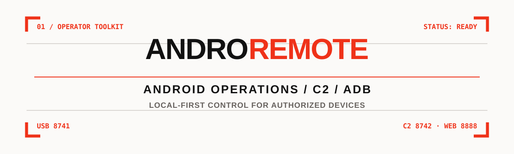

<p align="center">
  
</p>

<h1 align="center">AndroRemote</h1>

<p align="center">
  <strong>Operate authorized Android devices from one local-first Python toolkit.</strong><br />
  A headless Android agent, USB/ADB bridge, encrypted C2 listener, and responsive web console.
</p>

<p align="center">
  <a href="#quick-start">Quick start</a> ·
  <a href="#what-you-get">What you get</a> ·
  <a href="#web-console">Web console</a> ·
  <a href="#documentation">Documentation</a> ·
  <a href="#security-and-responsible-use">Responsible use</a>
</p>

<p align="center">
  
  
  
</p>

> AndroRemote is for devices you own or are explicitly authorized to administer. It can access sensitive device data and perform privileged operations; use it only in a controlled, consent-based environment.

## 🧭 Why AndroRemote

Android operations are often split between `adb`, one-off scripts, and a dashboard that cannot explain what happened. AndroRemote provides one operator surface for device identity, screenshots, input, files, diagnostics, permissions, and selected communications features.

It is deliberately local-first:

- **USB / ADB direct** works without an Internet service when a device is attached.
- **C2 over HTTPS** is optional for devices that can reach an operator listener through a user-managed Cloudflare Tunnel.
- **CLI and web console** share the same command and session model.
- **The APK has no app UI**; setup and consent happen through Android system surfaces and the operator tools.

## 📸 Interface preview

The repository includes project-native console visuals built from the real CLI and Web UI structure, populated with clearly labeled synthetic demo data.

<p align="center">
  
</p>

<p align="center"><em>Responsive operator console: overview, screen control, data, files, terminal, builds, cache, and settings.</em></p>

<p align="center">
  
</p>

<p align="center"><em>Rich terminal workflow for session selection, commands, results, and plugin output.</em></p>

## 🧰 What you get

| Surface | Purpose |
| --- | --- |
| ⌨️ `androremote` CLI | Unified entry point for the C2 console, plugins, and ADB shortcuts. |
| 🛰️ `c2.py` / C2 listener | Queues commands, receives agent beacons, records results, and manages sessions. |
| 📱 Android agent APK | Headless `RemoteService` with TCP direct mode and optional outbound beacon mode. |
| 🖥️ React/Vite web console | Live SSE state, screen actions, targeted data, files, builds, cache, and settings. |
| 🧩 Plugin engine | Auto-discovers built-ins and user plugins from `~/.androremote/plugins`. |
| 🔧 `build.sh` | Resource compile, Java compile, DEX, alignment, signing, and build metadata. |

### ⚙️ Core operations

- Device identity, permissions, battery, storage, uptime, RAM, and network information
- Screenshots through Android accessibility capture, MediaProjection fallback, or ADB fallback
- Accessibility-backed tap, swipe, text entry, navigation actions, wake, sleep, and best-effort PIN unlock
- Targeted file listing, upload, download, and hash-aware transfer paths
- Contacts, inbox SMS, call logs, photos, notifications, location, and microphone capture when the required Android permission is granted
- App listing and launch, clipboard, volume, torch, vibration, and agent update operations
- Result caching for safe read-heavy operations and live event streaming over SSE

## 🗺️ Architecture

```text
                         optional outbound HTTPS
┌──────────────────┐     ┌──────────────────────────────┐
│ Android agent    │────▶│ Cloudflare Tunnel             │
│ RemoteService    │     └──────────────┬───────────────┘
│ C2Beacon         │                    │
└────────┬─────────┘                    ▼
         │ adb forward             ┌───────────────┐
         │ tcp 8741 → 8740         │ c2.py :8742  │
         ▼                        │ session core  │
┌──────────────────┐              └──────┬────────┘
│ macOS operator   │◀─────────────────────┘
│ CLI / Web UI     │      commands + results
│ web :8888        │
└──────────────────┘
```

The C2 transport uses AES-256-GCM payload encryption by default. The web UI binds to `127.0.0.1` by default and supports an optional bearer token when deliberately exposed on another interface.

## 🚀 Quick start

### 🧱 Requirements

For the Python tools:

- Python 3.10+
- `rich` and `cryptography` (installed by the package)

For APK builds on macOS:

- JDK 8; set `J8` to override the default path
- Android SDK platform `android-35` and build-tools `35.0.0`; set `SDK` to override
- `adb` from Android platform-tools
- `openssl`

For Internet C2 only:

- `cloudflared`, installed with `brew install cloudflared`

### 📦 Install

```sh
python3 -m venv .venv
. .venv/bin/activate
python -m pip install -e .
```

This registers `androremote` and `c2` in the active environment.

### 🔌 USB / ADB direct mode

Build the agent without a C2 endpoint, install it on an authorized test device, and create the local bridge:

```sh
./build.sh
adb install -r -g build/apk/androremote.apk
adb shell am start-foreground-service -n com.ohmpi.androremote/.RemoteService
adb forward tcp:8741 tcp:8740

androremote ping
androremote id
androremote screen /tmp/device.png
```

Use `androremote --help` for the complete command matrix. Common commands include `perms`, `drives`, `ls`, `get`, `put`, `tap`, `swipe`, `settext`, `gaction`, `apps`, `loc`, and `update`.

### 🌐 C2 mode

Start the listener and optional web console:

```sh
androremote --web --web-port 8888
```

The server prints the active tunnel URL and the matching build command. Build and install the APK with that URL:

```sh
./build.sh https://your-c2-host.example
adb install -r -g build/apk/androremote.apk
adb shell am start-foreground-service -n com.ohmpi.androremote/.RemoteService
```

For a stable hostname, configure a named tunnel once:

```sh
python3 c2.py --setup-tunnel c2.yourdomain.com
```

Quick-tunnel URLs rotate when the server restarts. Rebuild and reinstall when the baked endpoint changes.

## 🖥️ Web console

Open `http://127.0.0.1:8888` after starting with `--web`.

| View | Includes |
| --- | --- |
| Overview | Session health, listener state, live activity, and derived metrics |
| Screen | Capture, tap, swipe, text entry, and navigation |
| Control | Messaging, audio, locks, hardware, clipboard, apps, and updates |
| Data | SMS, calls, contacts, notifications, apps, photos, permissions, and location |
| Files | Browse, upload, download, and delete |
| Terminal | Raw command REPL |
| Builds | Build configuration, signing metadata, and APK history |
| Cache / Settings | Result cache, theme, refresh preferences, tunnel, and server state |

The UI requests sensitive data only from the relevant operation. Preferences such as theme, refresh interval, and page size are stored in browser `localStorage`.

## 🧩 Plugins

Built-ins are loaded from `androremote/plugins/builtin/`:

- `triage` - device information, permissions, network, location, and recent notifications in one report
- `file_hunter` - targeted searches for document, key, database, archive, and image files
- `monitor` - beacon intervals, session telemetry, and recent result events

```sh
androremote plugins list
androremote plugins info triage
```

The C2 REPL also supports `/plugins`, `/plugin load <path>`, and plugin commands such as `/triage` and `/monitor`.

## 🔐 Build and signing notes

`build.sh` performs the Android build without Gradle: `aapt2` resource compilation/linking, JDK 8 compilation, `d8`, APK alignment, and `apksigner` signing. On the first build it creates a local signing key under `keystore/`; the key and password are ignored by Git.

Keep the same signing key for future updates. Android rejects an update signed with a different key. The C2 URL, optional PSK, and certificate pin are written into the generated build resources, so treat APK artifacts as environment-specific.

## 📚 Documentation

[`GUIDE.md`](GUIDE.md) contains the full capability matrix, protocol details, provisioning notes, tunnel behavior, permissions, operator REPL reference, update flow, and plugin documentation.

The main implementation areas are:

```text
androremote/                         Python C2, CLI, ADB, events, and plugins
app/src/main/java/...                Android services and receivers
webui/src/                           React/Vite operator console
build.sh                             Standalone APK build and signing pipeline
docs/images/                         Interface evidence used above
```

## 🛡️ Security and responsible use

- Operate only devices you own or have explicit authorization to manage.
- Keep the C2 listener and web UI behind access controls. The web UI is loopback-only by default; use `--web-token` when changing that boundary.
- Keep `~/.androremote/c2.key`, certificate material, signing keys, `.pass` files, APKs, and tunnel configuration private.
- Android permissions and special access are visible in system settings and are required for the corresponding operations.
- Do not use the tool to access another person’s messages, calls, files, location, microphone, camera, or accounts without documented consent.
- Test on disposable devices first. Some operations are OEM- and Android-version-dependent; see the limitations in [`GUIDE.md`](GUIDE.md).

## 📄 License

No `LICENSE` file is currently present in this checkout. Add a license before treating the public repository as distributable software.
